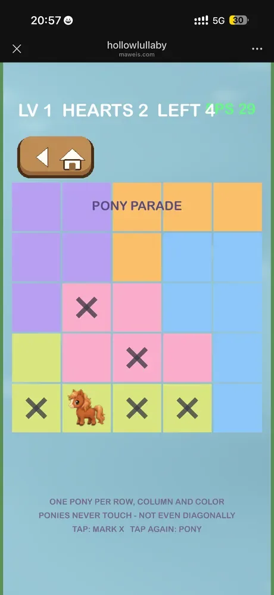
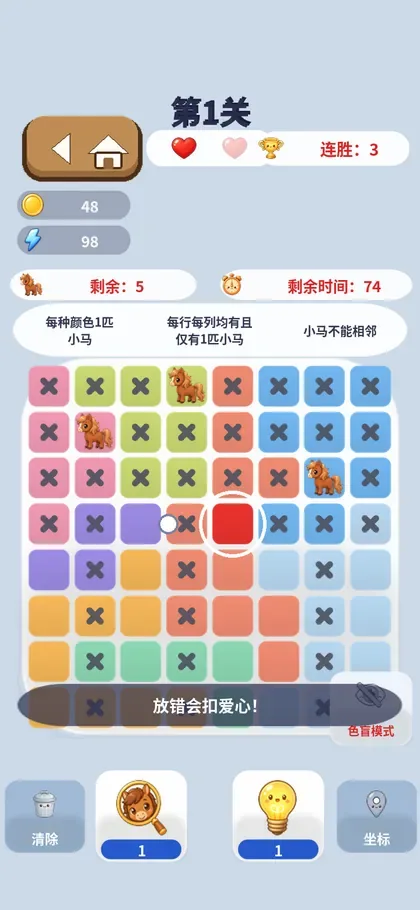

# 开发教程 · 上篇 |《小马拼图》:一张截图、一段视频,复刻一款解谜手游

> 两款游戏,两篇教程。这是**上篇**:从一张截图起步、以一段玩法视频为验收标准,做出一款可上线的 Queens/Star Battle 解谜游戏。下篇《深夜画廊》见[这里](./2026-07-07-tutorial-part2-midnight-gallery.md)。

先把这套开发方式的分工说清楚,因为它是全文的主线:

**我(开发者)全程只提供了三样东西:截图、视频、一两句话。** 玩法调研是 agent 做的,视频关键帧是 agent 截取比对的,提示词是 agent 自己组织的——**我没有写过一条复杂的提示词。**

*成品:圆角瓦片、粗体中文标题、心数/倒计时/连胜 HUD——对照玩法视频逐帧还原。*

---

## 第 1 步 · 输入一张截图:"玩法你自己去调研"

我发给 agent 一张某款解谜手游的截图,配的话只有一句:

> 开发一个这个游戏,数独变种,具体玩法和规则你自己去调研。

注意这句话里没有规则、没有配色、没有交互说明。接下来是 agent 的活:

- **从截图识别玩法族**:棋盘 + 单类棋子 + 区域染色 → 判断为 **Queens / Star Battle** 类逻辑谜题;
- **调研补全规则细节**:每行、每列、每个色区恰好放一子,任意两子不得相邻(含对角);
- **把规则写成可测试的不变量**:上面三条直接变成无头测试的断言——规则文档就是测试本身;
- **实现**:一个 Lua 文件装下棋盘生成器 + 交互 + 判定,自注册进游戏菜单,当天上线(PR #8)。

这一步的要点:**"调研"是 agent 的能力,不是你的前置作业。** 你甚至可以不知道这个玩法叫什么名字。

## 第 2 步 · 输入一段视频:"完全复刻它的 UI 和玩法"

v1 能玩,但和原作气质差得远。我丢给它一段原作的**玩法录屏**:

> 看一下这个游戏的玩法视频,完全复刻他的 UI 和玩法,画面尺寸、元素都要一样。

agent 对视频做的事:

- **抽取关键帧**,逐帧比对出 UI 元素清单:8×8 棋盘、顶部圆角关卡徽章、心数、倒计时、连胜火焰;
- **从帧序列读出交互节奏**:点一下放子 → 冲突格自动打 ✕ → 过关庆祝动画的触发时机;
- **量出布局比例**:棋盘占屏比、HUD 高度、元素间距,而不是"看起来差不多"。

然后按这份"从视频里读出来的规格"重写了整个界面与交互(PR #10)。**视频就是需求文档——由 agent 来读。**

## 第 3 步 · 输入一张不满意的截图:反馈驱动打磨

我截了一张当时的游戏画面,指出问题:

> 尺寸不对,我提供的里面是 8×8 的格子……格子有一些圆角,有打了 X 的状态……你现在用的不是图形,是色块……请提高还原度,让游戏精美一点,同时游戏相机的高级效果也要提供一下。

一条消息,四项改动全部落地(PR #11):

| 反馈 | agent 的修法 |
|---|---|
| "色块不是图形" | 新写 8× 超采样贴图生成器:可染色圆角瓦片、粗体 ✕、胶囊、卡片 |
| "字体不够圆润" | 字体换 Noto Sans SC Bold 子集,逐字校验无缺字 |
| "8×8 的格子" | 升 8×8 后盲随机找不到唯一解(首关实测 **237 个解**)→ 改**爬山精炼**收敛到唯一解 |
| "相机高级效果" | 给引擎加 `game.zoom()`:放对轻推、放错重推、过关猛推近再回弹 |

其中"唯一解"那条值得展开:这是个真 bug,**是测试逼着修好的**——套件断言每关解数恰为 1,盲重摇过不了,agent 只能换算法。你不用盯着它偷懒,测试盯着。

## 第 4 步 · 配乐与广告:素材管线一条龙

> "给这个游戏配一个音乐吧""不要用 ace 那个来做 bgm,ace 那个 model 是坏的"

BGM 由 Floniks 文生音乐(Lyria 2)生成(PR #12)。之后的 **15 秒玩法广告视频**同样出自这条管线:用游戏**真实素材**逐帧渲染出关键帧(手指演示放马 → 自动打 ✕ → 过关庆祝),交给 Floniks 图生视频,配上 Lyria 2 的配乐——上架物料全自动。

*广告视频的关键帧:画面元素全部是游戏内真实素材。*

小马棋子本身也是 Floniks 文生图 + 抠底 + 48×48 落位的产物:

## 这篇教程的方法论小结

1. **截图 = 立项书**。agent 负责从截图识别玩法族并调研规则。
2. **视频 = 需求规格**。agent 抽关键帧、读交互节奏、量布局比例。
3. **不满意就再截一张图**。反馈全部用截图对照驱动,不需要形容词功底。
4. **测试是验收官**。规则写成不变量,"唯一解"这类 bug 逃不掉。
5. **全程零复杂提示词**。上面每个引号里的话,就是我说过的全部。

👉 [在浏览器里玩《小马拼图》](https://maweis.com/rust_bevy_lua_game/) · [下篇:《深夜画廊》](./2026-07-07-tutorial-part2-midnight-gallery.md)
