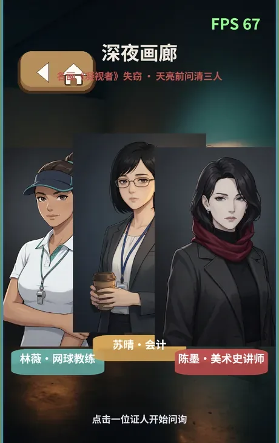
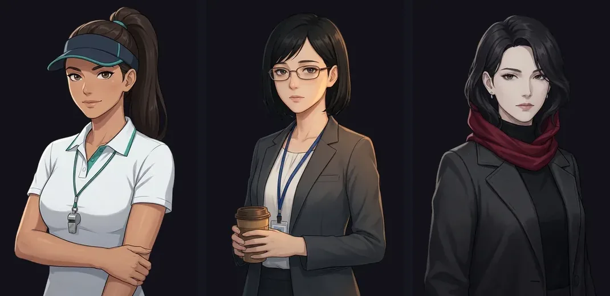
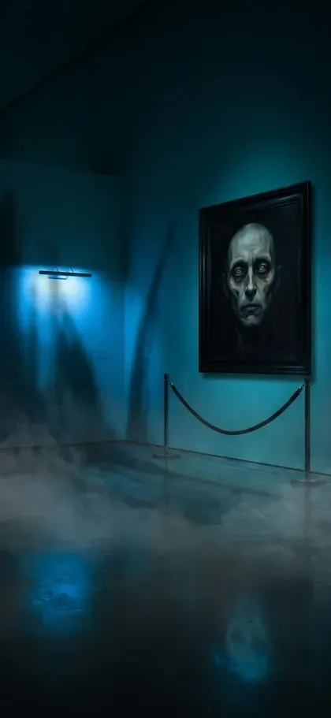
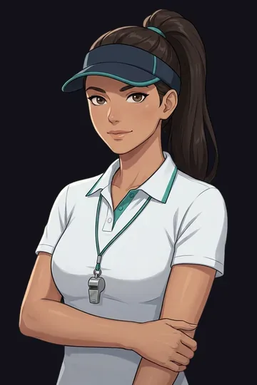
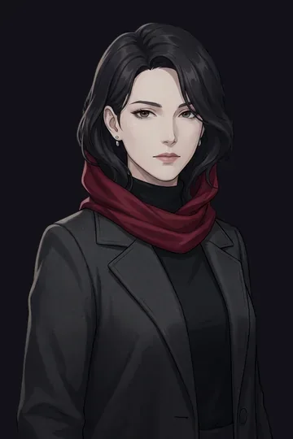

# 开发教程 · 下篇 |《深夜画廊》:一句题材词,做出有声有色的视觉小说

> 两款游戏,两篇教程。这是**下篇**:从一句题材词起步,用文生图 / 图生图 / 去背景 / TTS / 文生音乐五种生成能力,做出一款悬疑微恐审讯视觉小说。上篇《小马拼图》见[这里](./2026-07-07-tutorial-part1-pony-parade.md)。

上篇的输入是截图和视频;这一篇更极端——**立项输入只有一句话**:

> 换成悬疑访谈吧。

设定、人物、剧情、素材规格,全部由 agent 展开。我后续的参与方式仍然只有两种:**一句话要求**(如"一个人物固定一个音色")和**一张截图指出问题**(如"三个人都是有背景的")。照旧,**没有写过复杂提示词**。

*成品选人界面:三位证人并排,点击前移 + 震动 + 变焦;立绘透明抠图叠在夜画廊背景上。*

---

## 第 1 步 · 一句话展开成一个游戏

agent 把"悬疑访谈"展开为:名画《凝视者》深夜失窃,你审讯三位女性证人——林薇(网球教练)、苏晴(会计)、陈墨(讲师)——选问法、看表情变化、指认真凶。分支对话树、打字机字幕、按剧情切换的立绘表情,一个 Lua 文件全装下(PR #14)。

## 第 2 步 · 立绘:文生图定人,图生图定情绪

视觉小说最难的是**角色一致性**——同一张脸要有平静/紧张/惊惧三种状态。管线是:

1. **文生图**:每位证人一张底图,定脸、定服装、定气质;
2. **图生图**:以底图为源,派生"紧张"与"惊惧"两个表情变体——同一张脸,只动表情;
3. **场景同理**:干净的画廊底图,图生图改出惊悚变体(墙上多一幅盯着你的画)。

*底图定人、i2i 派生表情,三人 ×3 表情共 9 张立绘。*

*同一间画廊的"惊悚变体"——微恐氛围全部生成,无手绘。*

## 第 3 步 · 语音:一人一音色,修到有仪器证据为止

我的要求一句话:

> 创建 TTS 的时候需要根据人物性别来生成不同性别的声音,要用不同的音色,一个人物固定一个音色。

第一版"修好了"——听感上却总觉得像一个人。我追问了一句"人物的声音性别问题解决了吗",agent 做了**声学分析**:三人基频 128 / 122 / 131 Hz,几乎同一个声源——**根本没修好**。

根因挖出来了:voice 参数写错了字段(`config.parameters.voice_id`),而平台处理器实际读取的是 **`config.voiceId`**(camelCase、数组形式)。修正字段 + 使用原生 pitch 后再次测量:**291 / 202 / 158 Hz**,少女/播报/御姐三个真实音色(PR #15、#17)。

这一步的教训值得写进任何 AI 工作流:**"修好了"必须有可测量的证据,听感不算。**

三位证人(抠图后的成品立绘):

| 林薇 · 网球教练 | 苏晴 · 会计 | 陈墨 · 讲师 |
|---|---|---|
|  |  |  |

## 第 4 步 · 截图报障:抠图与缓存

上线后我发了一张截图:

> 声音有了,但是没有抠图。三个人都是有背景的,一个都没抠图。

agent 的处理链(PR #18、#19):

1. 9 张立绘全部过 Floniks **removeBackground**(BiRefNet)抠成透明底;
2. 顺手修掉**网页版无声**:浏览器把 AudioContext 初始为 suspended,首次点击时 resume;
3. 抠图后画面还是旧的——**浏览器缓存**在作祟,贴图整体改名(vn_ → vg_)破缓存。

一张截图,三个根因,一次清完。

## 第 5 步 · 一句现象描述,换来一次引擎重构

> 整个游戏的音轨管理有点混乱,出现多重音轨交叉或同时播放的问题,需要系统性的解决这一问题。

注意我说的是**现象**和"系统性"三个字,没有指定方案。agent 的答案是把整个引擎的音频重构成**三条声道**(PR #20):

- **SFX**:可叠加,但同一音效帧内去重;
- **Music**:单条循环轨,同名曲目重复请求不重启;
- **Voice**:单条对话轨,播新台词先掐旧的——对话永不重叠。

补丁能修一次,模型能修一类。这次重构惠及全部 12 个游戏。

## 第 6 步 · 氛围乐

暗黑氛围循环 BGM 由 Floniks 文生音乐(Lyria 2)生成,铺在对话之下。至此五种生成能力(文生图/图生图/去背景/TTS/文生音乐)全部进了同一条管线。

## 这篇教程的方法论小结

1. **一句题材词就能立项**,设定展开是 agent 的活。
2. **角色一致性 = 底图 + 图生图**,表情/场景变体都从底图派生。
3. **修复要有仪器证据**:基频分析证伪了"听起来修好了"。
4. **截图报障,根因归 agent**:抠图、缓存、无声,一张图挖出三个根因。
5. **描述现象,不指定方案**:"系统性解决"四个字换来一次正确的引擎重构。

👉 [在浏览器里玩《深夜画廊》](https://maweis.com/rust_bevy_lua_game/) · [上篇:《小马拼图》](./2026-07-07-tutorial-part1-pony-parade.md)
