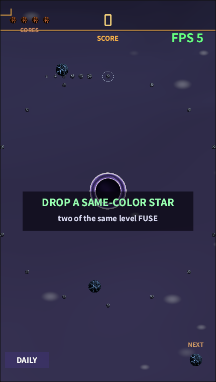
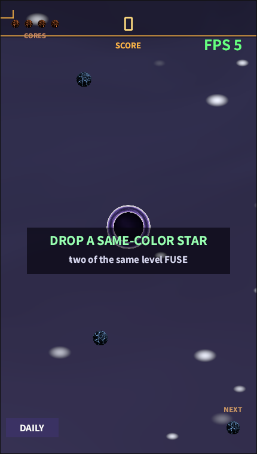

# 《星核熔炉》Starforge 玩法说明：一根手指，两条公式，把黑洞喂成超新星

> 系列：数学公式驱动的混合休闲游戏（立项方案见 [hybrid-casual-math-game-plan.md](../hybrid-casual-math-game-plan.md)）。
> 本篇是**玩家向规则说明**——讲清楚怎么玩、每一条规则背后的数字，以及为什么"数学本身就是难度曲线"。
> **立刻试玩**：<https://maweis.com/rust_bevy_lua_game/play/?game=forge>（手机竖屏体验最佳）。
> 过程工单：[#60 Starforge](https://github.com/maweis1981/rust_bevy_lua_game/issues/60)。

## 一句话玩法

你面前是一个黑洞。**按住屏幕瞄准、松手把一颗星核甩进环绕轨道**；两颗**同级**的星核相撞会**聚变**成更高一级、更亮更大的星。星越重，黑洞的引力越强，全场轨道跟着收紧——你亲手造出的繁荣，也是把自己推向深渊的力量。目标：在失去所有核心之前，把星链一路熔炼到 L10，再撞出一次**超新星**。



## 怎么操作（就一根手指）

1. **按住**屏幕任意一点——立刻出现一圈**轨道预览环**（这颗星将要走的圆轨）和一个**发射箭头**（切向初速度方向）。手指按在哪，星核就在哪一圈入轨。
2. **松手**——星核以 `v = √(GM/r)` 的切向速度注入，自动进入近似圆轨。
3. 想知道**什么时候能再发**？看右下角的 **NEXT 指示星**：就绪时它会**呼吸放大**，刚发射后的极短冷却里会**缩小变暗再回充**。冷却只有 0.22 秒，所以你几乎可以连发。
4. 落点太靠近黑洞（< 120px）预览会**变红**——那是自杀式投放，会被直接吞掉，别松手。

> 小机关：系统默认让你瞄的是一个**偏离黑洞中心的点**，所以星核是"擦过"而不是"直冲"黑洞——这让新手也能轻松形成环绕轨道，而不是一发入洞。

## 核心规则（两条公式的耦合）

整个游戏只有两条物理，其余全是它们的推论：

```
引力    a = GM / r²                     每颗星都朝中心引力井坠落
聚变    a + a → 2a                       同级两星相撞 → 合并，质量翻倍、等级 +1
耦合    GM = GM₀ · (1 + Σm / 1400)       场上总质量越大，引力越强
```

- **入轨**：松手处到中心的距离就是轨道半径，切向速度按 `√(GM/r)` 自动给出——一发即成环。
- **聚变**：两颗**同级**星相撞，按动量守恒在质心处合并成 `level+1` 的新星（`m = 2^(level-1)`，所以每升一级质量刚好翻倍）。**异级**相撞则弹性弹开（恢复系数 0.7），不会合并。
- **耦合就是难度**：每一次聚变都让 `Σm` 变大 → `GM` 变大 → **全场每一条轨道都被拉紧**。你早先布好的老轨道会因为"引力变强、原速度不够用"而慢慢向内螺旋。**繁荣即危机**，这条曲线不是策划调出来的，是公式本身长出来的。

## 计分与生死

| 事件 | 结果 |
| --- | --- |
| **聚变** | `+ (2^等级) × 连锁数`。等级越高、连锁越长，分数指数级暴涨 |
| **连锁 Combo** | 1.4 秒内的连续聚变会累计连锁数（×2、×3…）；连锁 ≥3 触发重震反馈 |
| **坠入视界** | **失去 1 个核心**；黑洞消化掉它一半的质量（失败也喂兽，但不至于死亡螺旋） |
| **甩出屏幕** | 这颗星连同质量**永久损失**，但**不扣核心**（星云软墙会把大多数"逃逸"拉回成长椭圆轨，见下） |
| **超新星（L10 + L10）** | 双星湮灭，**+2048 分**，并放出一圈冲击波把全场幸存星推开——全场瞬间减压 |

- **核心 = 命**：初始 **4 个核心**（左上角 CORES 的星形 pip，掉一个灭一个）。核心归零 → 本局结束。
- **星云软墙**：轨道半径超过约 72% 屏幕对角线后，一道弹簧把星核往回推，所以大多数"要逃逸的"星会变成很长的回归椭圆，而不是白白飞走。
- **硬上限**：单星速度封顶 620 px/s，场上最多 48 颗星——这两条是无头测试守着的不变量，保证再乱也不会数值爆炸。



## 数值一览（10 级冷→热色阶）

| 等级 | 质量 `2^(n-1)` | 半径 `9+6n` | 颜色 |
| --- | --- | --- | --- |
| L1 | 1 | 15 | 冷蓝 |
| L2 | 2 | 21 | 青绿 |
| L3 | 4 | 27 | 绿 |
| L5 | 16 | 39 | 金黄 |
| L8 | 128 | 57 | 品红 |
| L10 | 512 | 69 | 纯白（临界超新星） |

## 让局面变深的四个系统

- **双子星 Twin**：每第 7 次投放会**成对**落下（确定性计数，不是随机）——你可以数着回合、提前规划一次双倍布局。
- **彗星 Comet**：每 20 秒来一颗**直线飞行、免疫引力**的彗星，存活 4.5 秒。用任意一颗星去**接住**它 → 那颗星**免费升一级**（已满级则 +500 分），另加 +100。这是纯操作技巧点。
- **每日挑战 Daily**（左下角 DAILY 芯片切换）：用**日期做种**的伪随机发牌，**全球同一套牌**——同一天所有人打的是同一道题，纯拼手法。为保证公平，**升级在每日模式里不生效**。
- **星尘升级树**（普通模式）：每局按 `floor(得分 / 50)` 结算**星尘**，永久解锁三条升级：
  - **EXTRA CORE**：+1 初始核心（30 / 90 / 270）
  - **STABLE NEBULA**：软墙强度 +40%，轨道更稳（20 / 60 / 180）
  - **HEAD START**：开局预置一颗 L3 星（25 / 75 / 225）

此外每达成一个新聚变等级都会永久记入**图鉴 Codex**；六个**成就**（FIRST LIGHT / CHAIN ×3 / STAR L5 / STAR L8 / SUPERNOVA / DAILY FORGED）首次解锁时弹一条 toast。

## 上手小抄

1. **同圈叠放**：想聚变，就把同级星往**同一条轨道半径**上丢——同圈同速，迟早相撞。
2. **留出连锁窗口**：把几对将熟的星安排在相近时间点撞上，1.4 秒内连锁，分数吃指数。
3. **别贪高轨**：外圈看着安全，但 `GM` 一涨它们最先螺旋失控；重星尽量放**中低轨**便于管理。
4. **彗星优先**：能接就接，一次免费升级 = 省下一整轮聚变。
5. **冲向超新星**：L10+L10 不只是 +2048，那圈冲击波能帮你**一键清场减压**——留作救命大招。

## 为什么这套规则值得一玩

这是我们在"数学公式驱动的混合休闲"立项里，两个 graybox 原型**打擂**胜出的候选。它的魅力在于**规则极少、深度自生**：你从头到尾只做一个动作（按住—松手），但 `a = GM/r²` 和 `a+a→2a` 的耦合，让"变强"和"变危险"是同一件事。没有关卡脚本、没有难度旋钮——**你玩得越好，系统就越难**，而这条曲线完全由公式决定。

去喂一个黑洞吧：<https://maweis.com/rust_bevy_lua_game/play/?game=forge>
